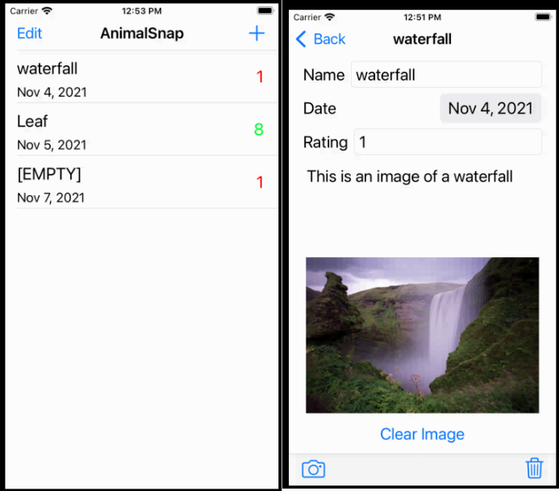

# Animal-Snap
Developed for CS275 at UVM October 2021 - iOS app for cute animal pictures and ratings

## Project Description
The app will be based off the one shown in class, except with animals. The user will be able to take a picture of a cute anmial and give it a rating. A streatch goal implementation is: if the user takes multiple images of the same animal, the front page will turn them into a folder with that label and the star rating would be the average of those animals. 

## UI Design
An example interface is shown below, modeled off of the demonstration in class. 

## UPDATES

 - User can score the animal pictures using the ratings
 
 - deleting from either view works now

 - Same grouping function was not implemented

 - The camera functionaility "should" work. Was not tested due to only working in the simulator, no camera functionailty. The code is there, but not tested

## UI Final Design

The finished Design for the main view and the detail view. This includes one [empty] block that happens when pressing the "+" button. 

The view for when editing the new item. Shows no "clear image" button since there's no image to clear yet. The delete icon will delete the item. The camera button will add an image from either the phone library or the camaera (camera functionality not tested)

