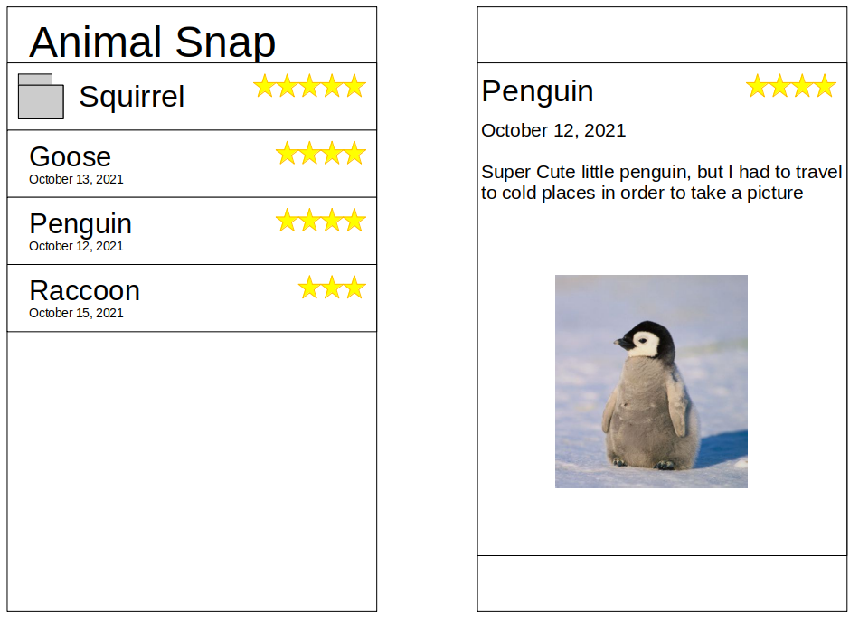

# Animal-Snap
Developed for CS275 at UVM October 2021 - iOS app for cute animal pictures and ratings

## Project Description
The app will be based off the one shown in class, except with animals. The user will be able to take a picture of a cute anmial and give it a rating. A streatch goal implementation is: if the user takes multiple images of the same animal, the front page will turn them into a folder with that label and the star rating would be the average of those animals. 

## UI Design
An example interface is shown below, modeled off of the demonstration in class. 

### TODO: Adding Functionality 

 - Convert price value to star ratings
 - persist images on exit
 - delete popup from menu
 - delete will actually delete the thing
